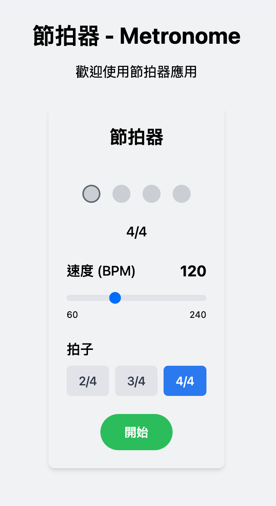

# 節拍器 (Metronome)

這是一個使用 React、TypeScript 和 Tailwind CSS 構建的網頁節拍器應用程序。它提供了直觀的界面，讓用戶可以調整速度和拍子，並提供視覺和聽覺反饋。

LiveDemo: https://milkmidi.github.io/metronome/index.html



## 功能特點

- **速度控制**：使用滾動條調整 BPM (每分鐘拍數)，範圍從 60 到 240
- **拍子選擇**：支持 2/4、3/4 和 4/4 拍子
- **視覺反饋**：顯示當前拍子位置，強拍有特殊標記
- **音頻反饋**：使用 Web Audio API 提供精確的定時控制和音頻播放
- **響應式設計**：適應不同屏幕尺寸的界面

## 技術棧

- **前端框架**：React
- **語言**：TypeScript
- **樣式**：Tailwind CSS
- **構建工具**：Vite
- **測試框架**：Vitest
- **代碼規範**：ESLint (Airbnb 風格指南)

## 安裝

1. 克隆倉庫：

```bash
git clone https://github.com/yourusername/metronome.git
cd metronome
```

2. 安裝依賴：

```bash
npm install
```

3. 添加音效文件：

在 `public/sounds` 目錄中添加以下音效文件：
- `strong-beat.mp3` - 強拍音效
- `weak-beat.mp3` - 弱拍音效

您可以從以下來源獲取免費的節拍器音效：
- [Freesound](https://freesound.org/search/?q=metronome)
- [SoundBible](https://soundbible.com/search.php?q=metronome)
- [Zapsplat](https://www.zapsplat.com/sound-effect-category/metronome/)

## 開發

啟動開發服務器：

```bash
npm run dev
```

然後在瀏覽器中打開 [http://localhost:3000](http://localhost:3000)。

## 測試

運行測試：

```bash
npm test
```

監視模式運行測試：

```bash
npm run test:watch
```

生成測試覆蓋率報告：

```bash
npm run test:coverage
```

## 構建

構建生產版本：

```bash
npm run build
```

預覽生產構建：

```bash
npm run preview
```

## 代碼規範

檢查代碼規範：

```bash
npm run lint
```

自動修復代碼規範問題：

```bash
npm run lint:fix
```

## 項目結構

```
metronome/
├── public/                # 靜態資源
│   └── sounds/            # 音效文件
├── src/                   # 源代碼
│   ├── components/        # React 組件
│   │   ├── metronome/     # 節拍器相關組件
│   │   └── __tests__/     # 組件測試
│   ├── types/             # TypeScript 類型定義
│   ├── utils/             # 工具函數
│   │   └── __tests__/     # 工具函數測試
│   ├── App.tsx            # 主應用組件
│   └── main.tsx           # 入口文件
├── tasks/                 # 任務拆解和計劃
├── .eslintrc.cjs          # ESLint 配置
├── tailwind.config.js     # Tailwind CSS 配置
├── tsconfig.json          # TypeScript 配置
└── vite.config.ts         # Vite 配置
```

## 使用方法

1. 調整滾動條設置所需的速度 (BPM)
2. 選擇拍子類型 (2/4, 3/4, 4/4)
3. 點擊「開始」按鈕啟動節拍器
4. 點擊「停止」按鈕停止節拍器

## 擴展性

該項目設計允許未來擴展以下功能：

1. 自定義音效
2. 更多拍子類型 (如 5/4, 6/8 等)
3. 節拍強弱設置
4. 節拍器預設保存
5. 節拍器模式 (如練習模式，逐漸加速模式等)

## 貢獻

歡迎貢獻！請隨時提交 Pull Request 或創建 Issue。

## 許可證

[ISC](LICENSE)